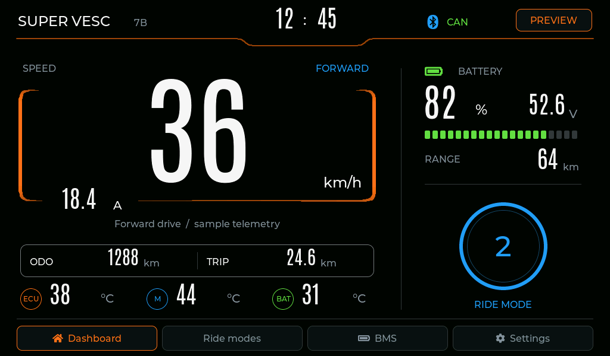

# Duyệt giao diện Waveshare 7B

Cập nhật 2026-09-18. Theo yêu cầu mới, không dùng FEATURE_SELECTION.md làm điều kiện triển khai. Cơ sở là phần cứng 7B và seed `esp32s3-vesc-bms`, nhánh `port/esp32s3-vesc-bms`, commit `664213605dffeed5d48e9653e6fe38dbcc28ae9c`.

## Bản cần duyệt

Chỉnh sửa theo phản hồi: đường cam dùng đường cong Bézier; thanh trên cùng giữ nét đều 2 px, đều màu; khung tốc độ chuyển độ dày 1–6 px và sắc độ đậm–nhạt. Chia đều ODO/TRIP, khoảng cách ba cụm nhiệt độ và căn giữa vòng số ở cột phải.

UI LVGL native Windows 1024 × 600. Chuyển ảnh `example_UI/cruise_control-02.12_1024x1024.webp` sang màn ngang: nền đen, viền cam, tốc độ lớn, dòng motor, ODO/TRIP, nhiệt độ ECU/motor/pin, SOC và điện áp. Thay cruise bằng P/1/2/3/R theo Lisp hiện tại.

- Dashboard: P, ba mode tiến, R, mất CAN, lỗi ESC; số liệu ESC không xác nhận hiển thị `--`.
- Ride modes: dòng 50/70/100 A, chỉnh và lưu RAM; minh họa clamp theo giới hạn ESC mẫu 70 A. Reverse có bật/tắt và thông số mẫu 3 km/h, 7 A.
- JK BMS: Overview, 16 cells, wires và nút thiết bị mẫu.
- Settings: độ sáng, CAN target ID và thông tin phần cứng.
- PREVIEW: chọn tình huống và bật/tắt animation dữ liệu mẫu.

[Ride modes](../simulator/7b/review/ride-modes.png) · [BMS](../simulator/7b/review/bms-overview.png) · [Cells](../simulator/7b/review/bms-cells.png) · [Settings](../simulator/7b/review/settings.png) · [Mất CAN](../simulator/7b/review/dashboard-stale.png)

## Giới hạn và bước tiếp theo

Đây là bản duyệt bố cục/tương tác. Telemetry, giờ, range và giới hạn ESC là dữ liệu mẫu; settings mất khi đóng app. Chưa chạy Lisp, CAN/BLE, driver RGB/GT911, NVS hoặc backlight thật. Dữ liệu BMS mẫu vẫn có khi mô phỏng mất CAN. Không gửi lệnh điều khiển VESC.

Sau khi người dùng duyệt mới ghép UI vào firmware S3, nối CAN/Lisp thực (freshness, sequence/token, Park/Reverse), JK BMS BLE và lưu settings; kiểm tra driver/touch/bộ nhớ trên phần cứng. Chưa nạp COM9 trong bước này.

## Kiểm tra

Build Release MinGW thành công. Self-test kiểm tra gear, điều hướng bốn trang, ba tab BMS, chặn đổi mode khi reverse và clamp dòng mẫu. Xuất 10 ảnh từ chính widget LVGL để kiểm tra trực quan. Kết quả tại `simulator/7b/review/review-result.txt`: 0 lỗi. Đây không phải kiểm thử firmware hoặc giao tiếp phần cứng.
